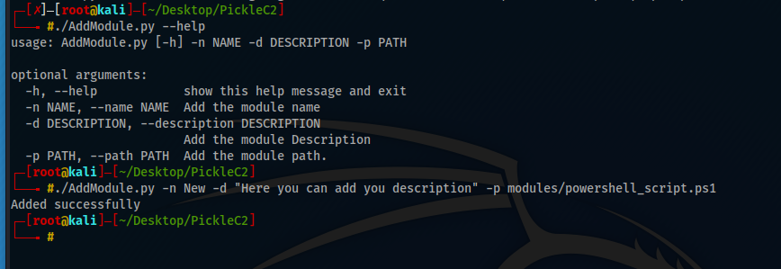
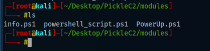

#####################
PickleC2 Modules
#####################

PickleC2 supports to anyone who would like to add his own powershell script to invoke in his target through adding his powershell module in the modules folder and add his module in the database.

***********************
Add PowerShell Module
***********************

For anyone who would like to add his powershell module must follow the following steps:

1. Run AddModule.py script.

2. Add the powershell module in modules Folder. 

************
Use Module
************

PickleC2 is so simple to use all you need to do to use a module is 

1. interact <Target_Name>

.. image:: _static/interact.png

2. module <Module_Name>

.. image:: _static/module.png

.. raw:: html
   :file: buymeacoffe.html