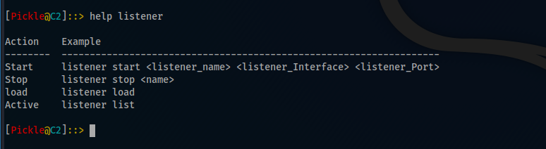

####################
How To Use PickleC2
####################

PickleC2 is so simple and easy to use and everything you need will be found in help option

************
How to help
************

The help command will show you everything you need and help can be used to show any option's help through ``help <Option>``

.. image:: _static/help.png
  

****************
How to Listener
****************

You can use ``help listener`` command to show all the listener commands.  

Listeners is built on flask.

FLASK is a popular Python web framework, meaning it is a third-party Python library used for developing web applications.

Start Listener
---------------

You can start your listener through

``listener start [Listener_Name] [Listener_Interface] [Listener_Port]``  

.. image:: _static/start_listener.png

Stop Listener
-----------------

You can stop your listener through

``listener stop [Listener_Name]``

List Listeners
-------------------

You can list all the listeners through 

``listener list``

Load Listener
---------------

You can use load listener if you have a not active listeners and you need to active them.

``listener load``

.. image:: _static/load_listener.png

*******************
How to Implant
*******************

In this section you will be able to create your implant.

Generate Implant
-----------------

You can generate implant through.

``implant generate [listener_name] [Implant_Lang] [Implant_Name]``

.. image:: _static/generate_implant.png

List Active Implant
---------------------

You can list all the active implant through

``implant list``

.. image:: _static/list_implant.png

********************
How to Interact
********************

After receiving the implant shell you can interact with it through

``interact [Implant_Name]``

.. image:: _static/interact.png

After entering the interact section you can use help command to show the interact commands.

Execute Powershell
--------------------

There is an option to execute a PowerShell Command through

``powershell [Command]``

Execute CMD
------------------------

There is an option to execute a CMD command through

``cmd [Command]``

.. image:: _static/execute_cmd.png

Invoke Module
----------------

There is an options to invoke a PowerShell script through

``module [Module_Name]``

.. image:: _static/module.png

Set Sleep
------------

There is an option to set a delay time through

``sleep [Secounds]``

.. image:: _static/sleep.png

Exit Implant
---------------

There is an option to end the implant activity through

``exit``

.. raw:: html
   :file: buymeacoffe.html